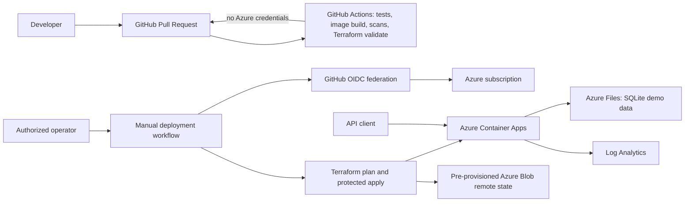

# Reference Architecture

## Components

## Request and delivery flow

1. A developer changes the Flask API, tests, docs, or Terraform and opens a pull request.
2. GitHub Actions tests the API, builds (but does not publish) a container, scans Python source and dependencies, scans for secrets, and validates Terraform and Markdown. Validation does not need Azure authentication.
3. After merge, an authorized operator manually dispatches the deployment workflow with an immutable public image URI. GitHub OIDC obtains short-lived Azure credentials.
4. Terraform creates a resource group, Log Analytics workspace, storage account and file share, Container Apps environment, and externally reachable Container App. The plan is stored as a short-lived artifact; apply and destroy run in protected `production` environment jobs.
5. The container mounts Azure Files at `/data`; the API stores its SQLite database there. Container Apps health probes use the API's live and ready endpoints.

## Trust boundaries and constraints

The public ingress and demo API have no user authentication; treat as non-production. Azure Files-backed SQLite and one replica are a teaching convenience only; SQLite locking/concurrency and file-share semantics do not provide a managed database service. The Terraform backend is a separately bootstrapped Blob container. Container image pull access assumes a public image; private registry credentials are not configured. Restrict ingress, add identity/authentication, use a managed database, private networking, Key Vault, and monitoring before production use.
